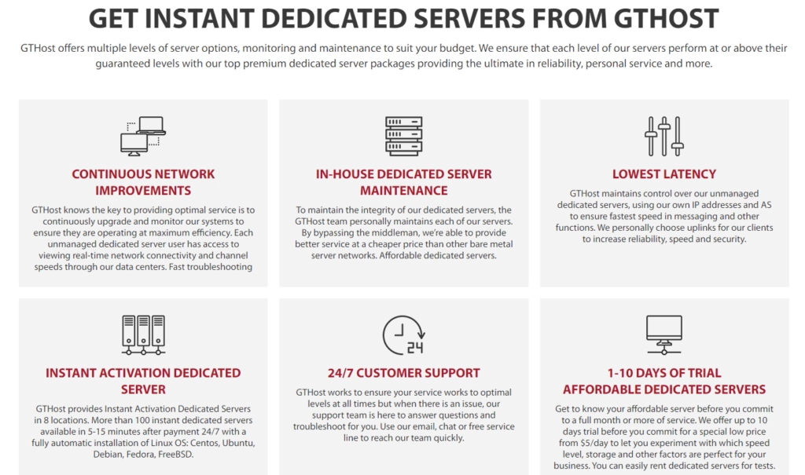

# GTHost的即时独立服务器真的靠谱吗?一个普通人的真实测评

---

找一个好用的服务器,真的比想象中难。价格、性能、部署速度——这三样东西很难同时凑齐。最近看到不少人在讨论GTHost的"即时独立服务器",说是几分钟就能用上。听起来挺诱人,但实际体验怎么样?我花了点时间研究了一下,顺便整理了些用户和专家的真实评价,给你讲讲这玩意儿到底值不值得试。

---

## 先搞清楚什么是"即时独立服务器"

传统的独立服务器你应该知道——买完之后要等人工配置,快的话几小时,慢的话可能要等上几天。而"即时独立服务器"就是把这个过程自动化了,系统预先配置好,你付完款基本上马上就能用。

## GTHost的即时独立服务器好在哪儿

### 1. 部署速度真的快(5/5)

这是最大的卖点,也是GTHost做得最好的地方。用户普遍反馈:付完款之后,几分钟服务器就能用了。如果你急着上线一个新项目,这个速度确实很救急。

### 2. 性价比还不错(4/5)

和传统独立服务器比,GTHost的价格算是比较友好的。虽然比共享主机或VPS贵一些,但考虑到性能表现,很多中小企业和创业团队觉得这钱花得值。

### 3. 性能稳定,很少掉链子(4.5/5)

GTHost在硬件上舍得投入,服务器跑起来比较稳。如果你的网站或应用对速度和在线时间有要求,👉 [选择GTHost的即时独立服务器能省不少心](https://cp.gthost.com/en/join/72c7e6b2fc118929f9ede2978f008806)。

### 4. 配置可以调整(4/5)

虽然是"即时"服务器,但GTHost还是给了一些自定义空间。CPU、内存、存储都能根据需求选,不是完全一刀切。

### 5. 客服24小时在线(4.5/5)

遇到技术问题或者不知道怎么操作,随时都能找到人帮忙。这点用户评价挺高的——毕竟半夜服务器出问题的时候,有人能立马响应真的很重要。

## 但也有几个槽点

### 1. 定制化程度有限(3.5/5)

如果你需要高度定制的服务器配置,GTHost可能满足不了你。它更适合那些"够用就行"的用户,而不是对服务器有极致要求的技术大佬。

### 2. 价格结构有点绕(3/5)

基础价格看起来还行,但加上各种附加功能和服务之后,账单可能比预期高。建议下单前仔细看清楚各项收费。

### 3. 没有完全的root权限(3/5)

GTHost的即时独立服务器更偏向"托管式"体验。如果你想完全掌控服务器的每个角落,可能会觉得受限。

### 4. 数据中心分布不够广(3.5/5)

根据我了解到的信息,GTHost的数据中心主要在北美和欧洲。如果你的用户主要在其他地区,可能需要考虑访问速度的问题。

## 真实用户和专家怎么说

### 用户评价:

**JaneDoe123(5/5):**  
"用GTHost一年多了,他们的即时独立服务器对我的电商网站来说简直是救星。服务器上线速度超快,客服团队也很给力,有问题随时能解决。"

**TechEnthusiast(4/5):**  
"性能确实不错,我的应用跑得很顺,停机时间也少。就是希望能提供更多自定义选项。"

### 专家评价:

**HostingReviewPros(4.5/5):**  
"GTHost的即时独立服务器在性能和价格之间找到了不错的平衡点。快速部署和稳定的基础设施是它的核心优势。不过,有特殊需求的用户可能需要看看其他方案。"

**WebHostingExperts(4/5):**  
"对于想要快速上线又不想牺牲性能的用户来说,GTHost是个靠谱的选择。全天候客服是个大加分项。价格体系有点复杂,选套餐时要多留心。"

**ServerWatch(4.2/5):**  
"GTHost在即时独立服务器这个细分领域做出了自己的特色。它介于共享主机的便捷和独立服务器的强大之间。虽然不是最便宜的,但从性能和支持来看,性价比还是在线的。"

## 总结一下

GTHost的即时独立服务器对很多人来说确实物有所值——部署快、性能稳、客服靠谱,价格也在可接受范围内。如果你需要的是一个"开箱即用"的服务器解决方案,不用折腾就能跑起来,那GTHost值得考虑。

但如果你对服务器有极致的定制需求,或者必须要完全的root权限,可能要再看看其他选择。

总之,买服务器这事儿,还是要看自己的实际需求和预算。如果GTHost的这些特点正好戳中你的痛点,👉 [不妨试试他们的即时独立服务器方案](https://cp.gthost.com/en/join/72c7e6b2fc118929f9ede2978f008806)——至少在快速上线和稳定运行这两件事上,它确实做得不错。
